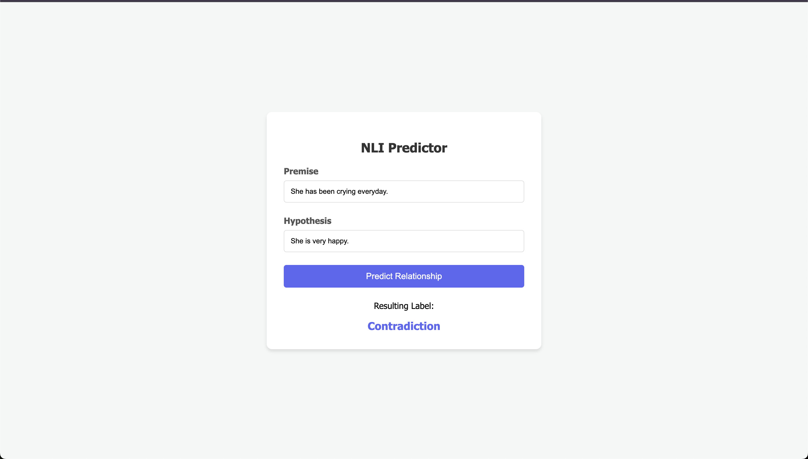

# A4: Do you AGREE? - BERT and Sentence-BERT from Scratch

## Project Structure
* `bert.ipynb`: The main notebook containing all the code for training and evaluation.
* `bert_from_scratch.pth`: The saved weights for the initial BERT model.
* `sbert_model.pth`: The saved weights for the Sentence-BERT model.
* `app/`: Folder containing the web application.

---

## Task 1: Training BERT from Scratch

For the first part, I implemented the standard BERT architecture including:
*   **Embeddings**: Combining token, positional, and segment embeddings.
*   **Multi-Head Attention**: Allowing the model to focus on different parts of a sentence simultaneously.
*   **Encoder Layers**: I used 6 layers with 8 heads each.

### Dataset
I used the **WikiText-2** (`wikitext-2-raw-v1`) dataset. Since training on the whole thing is computationally heavy, I followed the instructions and took a subset of **100,000 samples**. I preprocessed the text by lowering the case and filtering out very short lines to make sure the model had enough context to learn from.

## Task 2: Sentence-BERT (SBERT)

After training the base BERT, I wrapped it in a **Siamese Network structure**. This means I passed two different sentences through the *same* BERT model to get their embeddings.

### The Objective
I used the **SoftmaxLoss** classification objective. I concatenated the vectors $(u, v, |u - v|)$ and passed them through a linear classifier to predict if the sentences represent:
1.  **Entailment** (They agree)
2.  **Neutral** (No clear link)
3.  **Contradiction** (They disagree)

### Dataset
I used the **SNLI (Stanford Natural Language Inference)** dataset from Hugging Face, specifically a subset of 20,000 samples for training.

---

## Task 3: Evaluation and Analysis

### Performance Metrics
After training for 10 epochs, I tested the model on the SNLI test set. Below is the classification report from my run:

| Category | Precision | Recall | F1-Score | Support |
| :--- | :--- | :--- | :--- | :--- |
| **Entailment** | 0.48 | 0.65 | 0.55 | 344 |
| **Neutral** | 0.42 | 0.49 | 0.45 | 327 |
| **Contradiction** | 0.48 | 0.22 | 0.31 | 329 |
| **Accuracy** | | | **0.46** | 1000 |

### Analysis & Challenges
1.  **Low Recall for Contradiction**: The model really struggled to identify contradictions (only 0.22 recall). It often confused "Neutral" statements with "Contradiction."
2.  **Small Dataset**: Because I only used 100k samples for BERT and 20k for SBERT, the model didn't see enough variety in language to become a "pro" at understanding logic.
3.  **Training Time**: Training from scratch is slow. Even with 10 epochs, the loss was still going down, suggesting that if I had more time and a bigger GPU, the accuracy would definitely improve.
4.  **Improvements**: To make this better, I would use a larger subset of the WikiText dataset and perhaps try "Hard Negative Mining" to help the model distinguish between neutral and contradictory sentences more effectively.

---

## Task 4: Web Application
I developed a simple web interface where you can:
1.  Enter a **Premise**.
2.  Enter a **Hypothesis**.
3.  The app uses the trained `sbert_model.pth` to tell you if the sentences agree, disagree, or are neutral.

**Example Screenshot of the Application**

1. Example "Entailment" Label:

2. Example "Contradiction" Label:

---

## Credits
*   **Data**: WikiText and SNLI via Hugging Face.